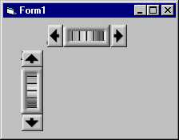



## A new type of control \- Thumb Wheel

### Description

An alternate to using Sliders, Scrollbars and UpDown controls. Not just an enhanced version of an existing type of control, but a new type of control altogether. Scrolls values up and down with the use of Visual thumb wheel, includes the ability to "Spin Over" to Minimum value when Maximum value has been attained and visa-versa.
 
### More Info
 
Properties set at design and run time when using the control.

Raises events "Change", "SpinMore" and "SpinLess".

Changes the value of the property "Value".

None known.

             |
---                |---
**Submitted On**   |2000-10-01 17:59:34
**By**             |[Nero](https://github.com/Planet-Source-Code/PSCIndex/blob/master/ByAuthor/nero.md)
**Level**          |Intermediate
**User Rating**    |4.7 (61 globes from 13 users)
**Compatibility**  |VB 5\.0
**Category**       |[Custom Controls/ Forms/  Menus](https://github.com/Planet-Source-Code/PSCIndex/blob/master/ByCategory/custom-controls-forms-menus__1-4.md)
**World**          |[Visual Basic](https://github.com/Planet-Source-Code/PSCIndex/blob/master/ByWorld/visual-basic.md)
**Archive File**   |[CODE\_UPLOAD103821022000\.zip](https://github.com/Planet-Source-Code/nero-a-new-type-of-control-thumb-wheel__1-11856/archive/master.zip)

### API Declarations

StretchBlt & BitBlt

